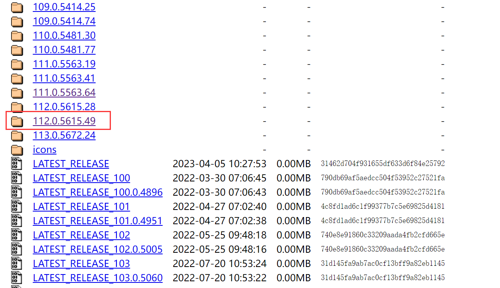

# amz_ratings_crawler

本项目通过浏览器自动化的方式爬取amazon产品的评分，总评价数和显示评价数。

## 环境准备&安装

1. 安装selenium浏览器驱动（以Chrome浏览器为例）：
  
  1.1 查看Chrome浏览器版本

  设置（右上角三个点） -> 关于Chrome -> 版本 xxx.yyy，记住这个一开始的xxx

  

  1.2 下载并安装驱动

  打开https://chromedriver.storage.googleapis.com/index.html

  找到xxx对应的文件夹（有多个一样的选个最新的）
  注意不是直接下红框里的文件夹里的文件！！而是找到你的Chrome对应版本号的文件夹！！

  

  windows系统下载chromedriver_win32.zip

  

  解压压缩包中的chromedriver.exe 到Chrome浏览器所在目录（通常默认为C:\Program Files\Google\Chrome\Application）（不用运行）

  

2. 安装本程序

   2.1 找个地方新建文件夹amz_ratings_crawler

   2.2 下载 [amz_ratings_crawler.exe](https://github.com/prismleong/amz_ratings_crawler/releases/download/v0.1/amz_ratings_crawler.exe) 到该文件夹中


## 运行

1. 在amz_ratings_crawler中新建文件asins.txt

   1.1 asins.txt中每一行的格式为

   ```
   产品型号: asin
   ```

2. 双击运行amz_ratings_crawler.exe
3. 结果在results文件夹中
